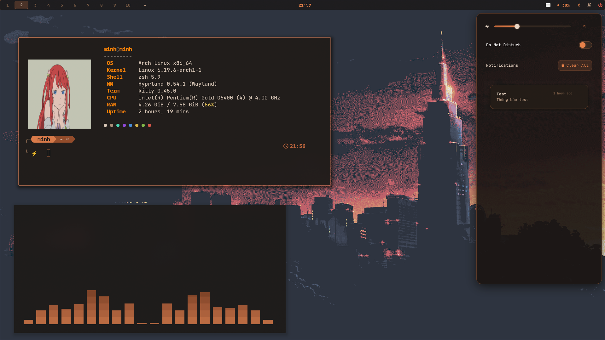
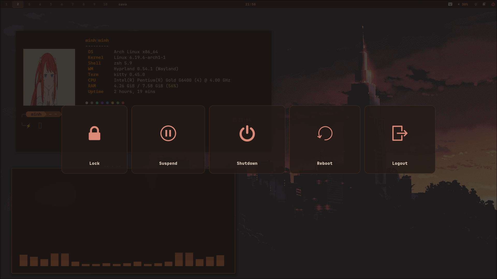
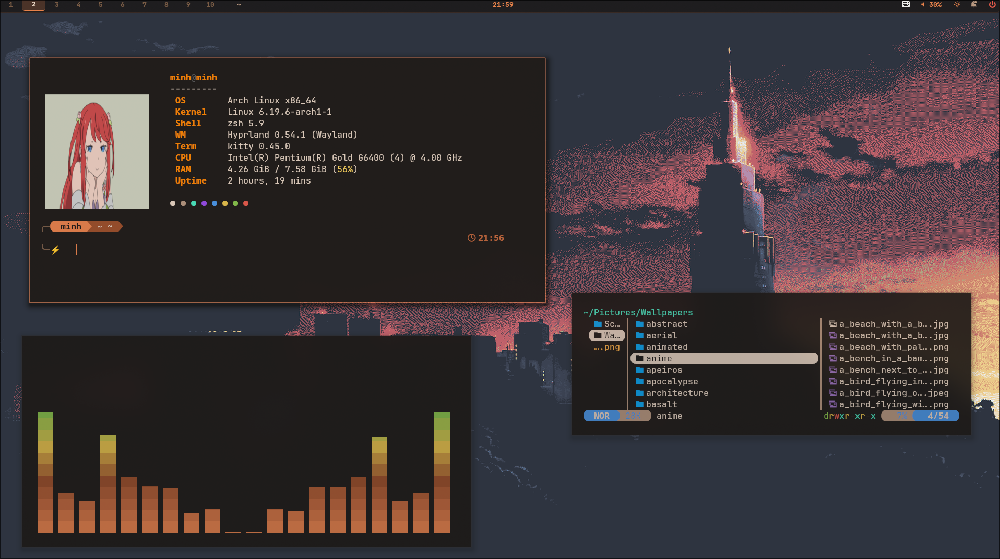
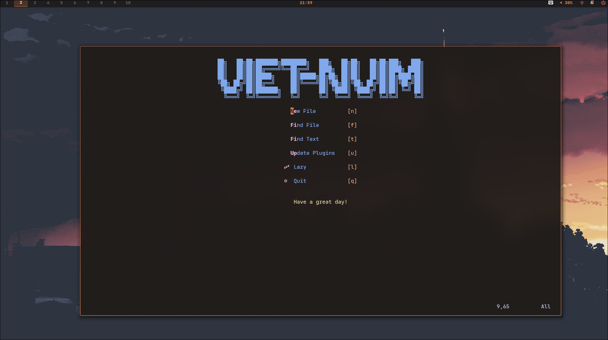
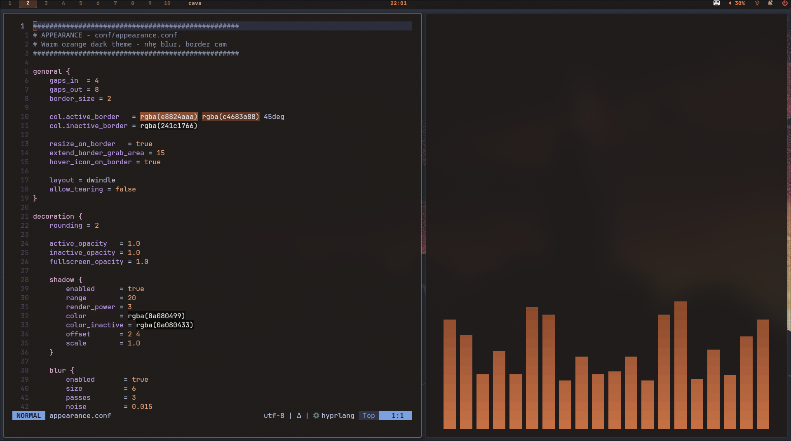

<div align="center">

# 🍊 Warm Orange Rice — Arch Hyprland

[](https://youtube.com/YOUR_VIDEO)
[](https://archlinux.org)
[](https://hyprland.org)

</div>

## 📸 Preview

https://github.com/hoangnhtminh/dotfiles/assets/preview.mp4

<div align="center">





## 📦 Stack

| Component | Package |
|-----------|---------|
| WM | Hyprland |
| Bar | Waybar |
| Launcher | Rofi |
| Terminal | Kitty / Foot |
| Notification | Swaync |
| Shell | Zsh + Oh-my-posh |
| Editor | Neovim |
| File Manager | Thunar / Yazi |
| PDF Viewer | Zathura |

## 🎨 Colors

| | `#1a1512` | `#241c17` | `#e8824a` | `#c4683a` | `#e8d5c4` |
|---|---|---|---|---|---|
| |  |  |  |  |  |

## 🚀 Install
```bash
git clone --depth=1 https://github.com/hoangnhtminh/dotfiles
cd dotfiles
chmod +x install.sh
./install.sh
```

> ⚠️ Backup config before install

## ⌨️ Keybindings

| Key | Action |
|-----|--------|
| `Super + Return` | Terminal |
| `Super + Space` | Launcher |
| `Super + E` | File Manager |
| `Super + B` | Browser |
| `Super + G` | Record |
| `Super + S` | Screenshot |
| `Super + Y` | Yazi |
| `Super + Escape` | Wlogout |
